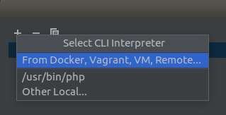
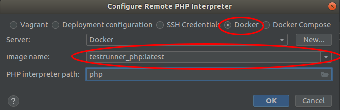
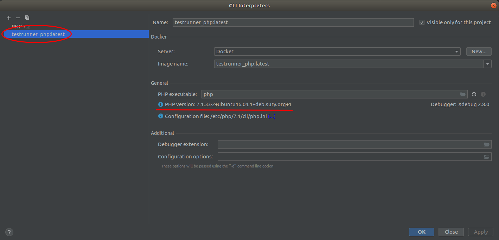

## Add composer execution via docker

In PHPStorm

Go to `Settings -> Language & Framework -> Composer` choose `Remote iterpreter` and than click to add new interpreter

 

Select CLI interpreter creation option

Select `Docker` and choose your project image

And done, now you have remote interpreter in your project 

At least you have to do right click by `composer.json -> composer -> install`. Dependencies successfully installed.